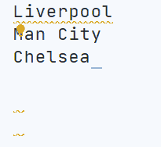

# Marky Edit


<!-- TOC -->
**Table of Contents**
- [Commands](#commands)
	- [Command List](#command-list)
	- [Inline Commands](#inline-commands)
	- [Line Commands](#line-commands)
	- [Block Commands](#block-commands)
- [Keyboard Shortcuts](#keyboard-shortcuts)
- [Features Under Consideration](#features-under-consideration)
- [Installation](#installation)
<!-- /TOC -->

## Commands

It's important to know what a command will do to the text *and* the cursor when it is executed, so that the editing experience feels natural.

I clearly outline what the commands do in the subsections below.

### Command List

The commands in the table below can be run from the Command Palette (`Ctrl+Shift+P`).

| Name                            | Title                                             |
|---------------------------------|---------------------------------------------------|
| marky-edit.toggleDelete         | Marky Edit: Toggle Delete (Strikethrough)         |
| marky-edit.toggleEmphasis       | Marky Edit: Toggle Emphasis (Italic)              |
| marky-edit.toggleCodeBlock      | Marky Edit: Toggle Fenced Code Block              |
| marky-edit.toggleHeading1       | Marky Edit: Toggle Heading 1                      |
| marky-edit.toggleHeading2       | Marky Edit: Toggle Heading 2                      |
| marky-edit.toggleHeading3       | Marky Edit: Toggle Heading 3                      |
| marky-edit.toggleHeading4       | Marky Edit: Toggle Heading 4                      |
| marky-edit.toggleHeading5       | Marky Edit: Toggle Heading 5                      |
| marky-edit.toggleHeading6       | Marky Edit: Toggle Heading 6                      |
| marky-edit.toggleHorizontalRule | Marky Edit: Toggle Thematic Break (Horizontal Rule)                |
| marky-edit.toggleImage          | Marky Edit: Toggle Image                          |
| marky-edit.toggleInlineCode     | Marky Edit: Toggle Inline Code                    |
| marky-edit.toggleLink           | Marky Edit: Toggle Link                           |
| marky-edit.toggleOrderedList    | Marky Edit: Toggle Ordered List (Numbered List)   |
| marky-edit.toggleQuote          | Marky Edit: Toggle Quote                          |
| marky-edit.toggleStrongEmphasis | Marky Edit: Toggle Strong Emphasis (Bold)         |
| marky-edit.toggleUnorderedList  | Marky Edit: Toggle Unordered List (Bulleted List) |

### Inline Commands

The table and GIF below demonstrate the command `marky-edit.toggleStrongEmphasis` for different scenarios. This pattern of behaviour is followed by all inline commands.


The inline markdown commands are:
- `marky-edit.toggleStrongEmphasis`
- `marky-edit.toggleEmphasis`
- `marky-edit.toggleDelete`
- `marky-edit.toggleInlineCode`
- `marky-edit.toggleImage`
- `marky-edit.toggleLink`

There are 2 points worth noting:
1. If there is no selection, it will insert a snippet. This enables you to navigate through the entry with tabstops (see item 2 in table), so that you can create a strongly emphasized word (or phrase) without making a selection or backtracking.
1. If there is no selection but it is within the boundary of a word, it will perform the edit command on that word (see item 3 and 5 in the table).

There is *one exception* to this, for the commands `marky-edit.toggleLink` and `marky-edit.toggleImage`, when you want to remove the markdown you have to make a complete selection like item 5 in the table. Item 4 in the table does *not* apply to these commands. It is more likely that you would delete the entire text fragment, rather than just remove the markdown!

### Line Commands

Line commands apply to an entire line.


If there is text on the current line, it will be overwritten.

The line commands are:
- `marky-edit.toggleHorizontalRule`
- `marky-edit.toggleHeading1`
- `marky-edit.toggleHeading2`
- `marky-edit.toggleHeading3`
- `marky-edit.toggleHeading4`
- `marky-edit.toggleHeading5`
- `marky-edit.toggleHeading6`

### Block Commands

Block commands perform multi-line edits.



The block commands are:
- `marky-edit.toggleCodeBlock`
- `marky-edit.toggleOrderedList`
- `marky-edit.toggleUnorderedList`

## Keyboard Shortcuts

I chose only to add shortcuts for emphasis and strong emphasis. I don't think it is a good idea to decide all of these settings for others.

| Command                         | Shortcut                                 | When                                                               |
|---------------------------------|--------------------------------------------|--------------------------------------------------------------------|
| marky-edit.toggleEmphasis       | Mac: `Cmd + I` <br> Windows: `Ctrl + I`<br>Linux: `Ctrl + I`| editorTextFocus && !editorReadonly && editorLangId ==   markdown |
| marky-edit.toggleStrongEmphasis | Mac: `Cmd + B` <br> Windows: `Ctrl + B`<br> Linux: `Ctrl + B` | editorTextFocus && !editorReadonly && editorLangId ==   markdown |

If you want to add more shortcuts for the extension commands, you can open the JSON file for Keyboard Shortcuts (by searching for `Preferences: Open Keyboard Shortcuts (JSON)` in the Command Palette), and add them in. The Keyboard Shortcuts UI only allows editing of existing shortcuts. 😕

To add a shortcut, add an object like below:

```JSON
{
	"key": "ctrl+b",
	"mac": "cmd+b",
	"command": "marky-edit.toggleStrongEmphasis",
	"when": "editorTextFocus && !editorReadonly && editorLangId == markdown"
}
```

I recommend using the same *when* clause as above. The *key* property creates a shortcut for all Operating Systems. The *mac*, *windows*, and *linux* properties allow you to create OS-specific shortcuts. You can read more about shortcuts in the [official docs](https://code.visualstudio.com/docs/getstarted/keybindings).

## Features Under Consideration

1. Update the "word pattern", which identifies what is a considered a word for syntax highlighting and selection.
1. Add text decoration for strong emphasis, and delete.
1. Add extended syntax support for tables and task lists.
1. Add heading level increase and decrease commands.
1. List editing. Add new item when hitting Enter.
1. Increase selection expansion for links and images, so that you do not have make the selection yourself to toggle it. Is this something that would be used?

## Installation

1. Inside VS Code: Type `Ctrl+P`, write `ext install robole.marky-edit` in the text field, and hit `Enter`.
1. From the Command-line: Run the command `code --install-extension robole.marky-edit`.
1. From the [VS Marketplace](https://marketplace.visualstudio.com/items?itemName=robole.marky-edit): Click the _Install_ button.
