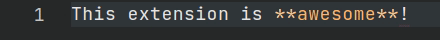
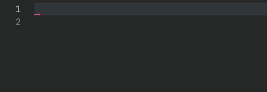
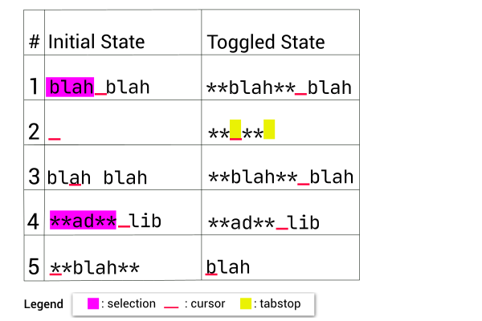
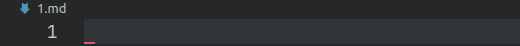
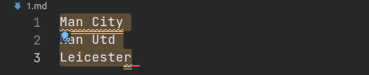

<h1 align="center">
  <br>
  
  <br>
	<br>
  Marky Edit
  <br>
  <br>
</h1>
<h4 align="center">Toggle-style editing for Markdown documents</h4>

<p align="center">


<a href="https://ko-fi.com/roboleary"></a>
</p>

Toggle-style editing offers a more natural editing experience. It enables you to mark or unmark text as you type.



It enables you to insert markdown fragments as snippets for simple completion.



Together this helps you maintain control of the cursor and avoid losing your place while you write.

### Commands

The commands in the table below can be run from the Command Palette (`Ctrl+Shift+P`).

| Name                            | Title                                             |
|---------------------------------|---------------------------------------------------|
| marky-edit.toggleDelete         | Marky Edit: Toggle Delete (Strikethrough)         |
| marky-edit.toggleEmphasis       | Marky Edit: Toggle Emphasis (Italic)              |
| marky-edit.toggleCodeBlock      | Marky Edit: Toggle Fenced Code Block              |
| marky-edit.toggleHeading1       | Marky Edit: Toggle Heading 1                      |
| marky-edit.toggleHeading2       | Marky Edit: Toggle Heading 2                      |
| marky-edit.toggleHeading3       | Marky Edit: Toggle Heading 3                      |
| marky-edit.toggleHeading4       | Marky Edit: Toggle Heading 4                      |
| marky-edit.toggleHeading5       | Marky Edit: Toggle Heading 5                      |
| marky-edit.toggleHeading6       | Marky Edit: Toggle Heading 6                      |
| marky-edit.toggleHorizontalRule | Marky Edit: Toggle Thematic Break (Horizontal Rule)                |
| marky-edit.toggleImage          | Marky Edit: Toggle Image                          |
| marky-edit.toggleInlineCode     | Marky Edit: Toggle Inline Code                    |
| marky-edit.toggleLink           | Marky Edit: Toggle Link                           |
| marky-edit.toggleOrderedList    | Marky Edit: Toggle Ordered List (Numbered List)   |
| marky-edit.toggleQuote          | Marky Edit: Toggle Quote                          |
| marky-edit.toggleStrongEmphasis | Marky Edit: Toggle Strong Emphasis (Bold)         |
| marky-edit.toggleUnorderedList  | Marky Edit: Toggle Unordered List (Bulleted List) |

### Inline Commands

Inline commands target a fragment within a line.

The table below demonstrates how the command `marky-edit.toggleStrongEmphasis` behaves for different scenarios. This pattern of behaviour is followed by all inline commands.



The inline markdown commands are:
- `marky-edit.toggleStrongEmphasis`
- `marky-edit.toggleEmphasis`
- `marky-edit.toggleDelete`
- `marky-edit.toggleInlineCode`
- `marky-edit.toggleImage`
- `marky-edit.toggleLink`

There are 2 points worth noting:
1. If there is no selection, it will insert a snippet. This enables you to navigate through the entry with tabstops (see item 2 in table).
1. If there is no selection but it is within the boundary of a word, it will perform the edit command on that word (see item 3 and 5 in the table).

There is *one exception* to this, for the commands `marky-edit.toggleLink` and `marky-edit.toggleImage`, when you want to remove the markdown you have to make a complete selection like item 5 in the table. Item 4 in the table does *not* apply to these commands. It is more likely that you would delete the entire text fragment, rather than just remove the markdown!

### Line Commands

Line commands apply to an entire line.



The line commands are:
- `marky-edit.toggleHorizontalRule`
- `marky-edit.toggleHeading1`
- `marky-edit.toggleHeading2`
- `marky-edit.toggleHeading3`
- `marky-edit.toggleHeading4`
- `marky-edit.toggleHeading5`
- `marky-edit.toggleHeading6`

If there is text on the current line and the command is execute, the existing text will be overwritten.

### Block Commands

Block commands perform multi-line edits.



The block commands are:
- `marky-edit.toggleCodeBlock`
- `marky-edit.toggleOrderedList`
- `marky-edit.toggleUnorderedList`

## Keyboard Shortcuts

I chose only to add shortcuts for emphasis and strong emphasis. I don't think it is a good idea to decide all of these settings for others, so I did not add any more!

| Command                         | Shortcut                                 | When                                                               |
|---------------------------------|--------------------------------------------|--------------------------------------------------------------------|
| marky-edit.toggleEmphasis       | Mac: `Cmd + I` <br> Windows: `Ctrl + I`<br>Linux: `Ctrl + I`| editorTextFocus && !editorReadonly && editorLangId ==   markdown |
| marky-edit.toggleStrongEmphasis | Mac: `Cmd + B` <br> Windows: `Ctrl + B`<br> Linux: `Ctrl + B` | editorTextFocus && !editorReadonly && editorLangId ==   markdown |

I would recommend adding shortcuts for the other commands to be able to edit everything with the keyboard. To do this, you open the JSON file for Keyboard Shortcuts with the command `Preferences: Open Keyboard Shortcuts (JSON)`. To add a shortcut, add an object like below:

```JSON
{
	"key": "ctrl+b",
	"mac": "cmd+b",
	"command": "marky-edit.toggleStrongEmphasis",
	"when": "editorTextFocus && !editorReadonly && editorLangId == markdown"
}
```

The *key* property creates a shortcut for all Operating Systems. The *mac*, *windows*, and *linux* properties allow you to create OS-specific shortcuts.

I recommend using the same *when* clause as above.

You can read more about shortcuts in the [official docs](https://code.visualstudio.com/docs/getstarted/keybindings).

## Installation

1. It is listed in the [VS Code Marketplace](https://marketplace.visualstudio.com/items?itemName=robole.marky-edit) and [Open VSX Marketplace](https://open-vsx.org/extension/robole/marky-edit) where you can download or install it directly.
1. Inside VS Code: Type `Ctrl+P`, write `ext install robole.marky-edit` in the text field, and hit `Enter`.
1. From the Command-line: Run the command `code --install-extension robole.marky-edit`.

## Show gratitude

If you are happy with the extension, please star the repo, and leave a review to help others find it. 🌟

You can [buy me a coffee](https://ko-fi.com/roboleary) if you would like to support me in my quest to make more great open-source software. ☕🙏

## Contribute

If you have a suggestion or find a bug, please file an issue.
